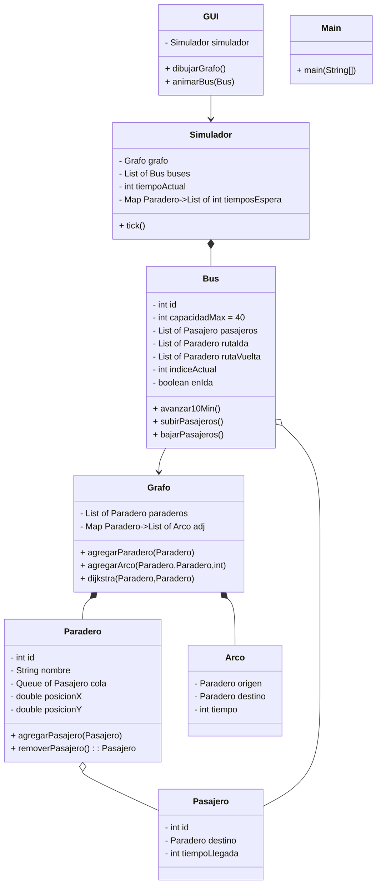

**Mermaid (classDiagram)**

```mermaid
classDiagram
    class Paradero {
      - int id
      - String nombre
      - Queue of Pasajero cola
      - double posicionX
      - double posicionY
      + agregarPasajero(Pasajero)
      + removerPasajero(): Pasajero
    }

    class Pasajero {
      - int id
      - Paradero destino
      - int tiempoLlegada
    }

    class Arco {
      - Paradero origen
      - Paradero destino
      - int tiempo
    }

    class Grafo {
      - List of Paradero paraderos
      - Map Paradero->List of Arco adj
      + agregarParadero(Paradero)
      + agregarArco(Paradero,Paradero,int)
      + dijkstra(Paradero,Paradero)
    }

    class Bus {
      - int id
      - int capacidadMax = 40
      - List of Pasajero pasajeros
      - List of Paradero rutaIda
      - List of Paradero rutaVuelta
      - int indiceActual
      - boolean enIda
      + avanzar10Min()
      + subirPasajeros()
      + bajarPasajeros()
    }

    class Simulador {
      - Grafo grafo
      - List of Bus buses
      - int tiempoActual
      - Map Paradero->List of int tiemposEspera
      + tick()
    }

    class GUI {
      - Simulador simulador
      + dibujarGrafo()
      + animarBus(Bus)
    }

    class Main {
      + main(String[])
    }

    Grafo *-- Paradero
    Grafo *-- Arco
    Paradero o-- Pasajero
    Bus o-- Pasajero
    Simulador *-- Bus
    Bus --> Grafo
    GUI --> Simulador

```
